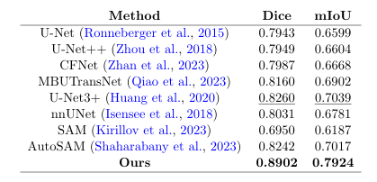
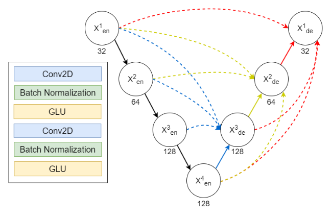
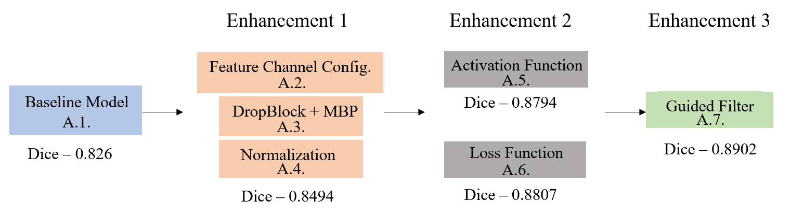
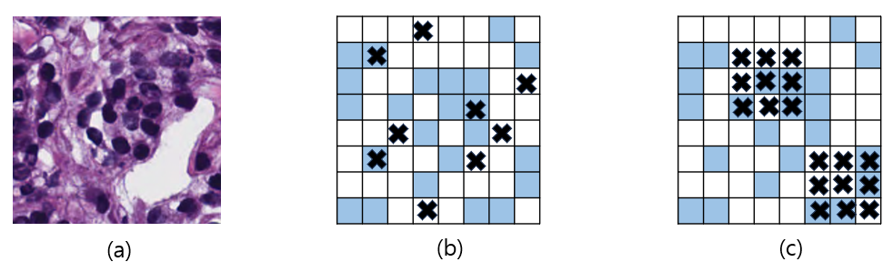
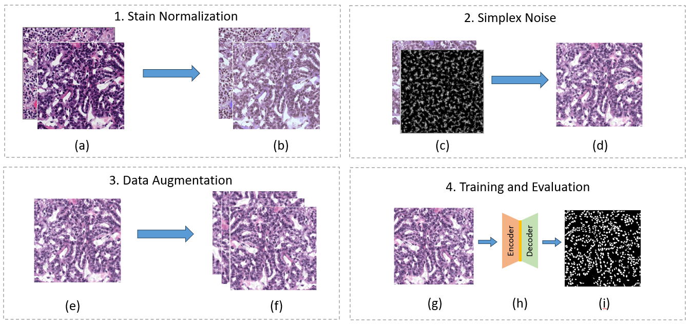
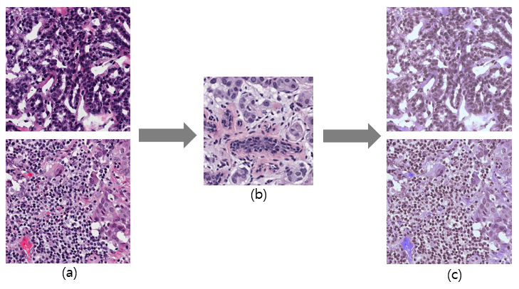

<br/>
<div align="center">
  
</div>

<p align="center">
  <h3 align="center">Nuclei Segmentation in Histopathological Images with Enhanced U-Net3+</h3>

  <p align="center">
    Official implementation of the paper published at MIDL 2024
    <br/>
    <br/>
    <a href="https://github.com/CVPR-KIT/NucleiSeg-in-Histopathology-Images/issues">Report Bug</a>
    ·
    <a href="https://github.com/CVPR-KIT/NucleiSeg-in-Histopathology-Images/issues">Request Feature</a>
  </p>
</p>

<p align="center">
<a href="https://github.com/CVPR-KIT/NucleiSeg-in-Histopathology-Images">
  
</a>
</p>

<div align="center">
  <h3> Qualitative Performance Comparison </h3>
  
</div>


<div align="center">
  <h3> Quantitative Performance Comparison </h3>
  
</div>

***

## Setup
1. Clone the repository:
    ```bash
    git clone https://github.com/CVPR-KIT/NucleiSeg-in-Histopathology-Images.git
    ```
2. Create a new environment and install the required packages:
    ```bash
    pip install -r requirements.txt
    ```

## Dataset
The dataset for this challenge was obtained by carefully annotating tissue images of several patients with tumors of different organs and who were diagnosed at multiple hospitals. This dataset was created by downloading H&E stained tissue images captured at 40x magnification from the TCGA archive. H&E staining is a routine protocol to enhance the contrast of a tissue section and is commonly used for tumor assessment (grading, staging, etc.). Given the diversity of nuclei appearances across multiple organs and patients, and the richness of staining protocols adopted at multiple hospitals, the training dataset will enable the development of robust and generalizable nuclei segmentation techniques that will work right out of the box.

### Training Data
Training data containing 30 images and around 22,000 nuclear boundary annotations have been released to the public previously as a dataset article in IEEE Transactions on Medical Imaging in 2017.

### Testing Data
Test set images with additional 7000 nuclear boundary annotations are available here: [MoNuSeg 2018 Testing data](https://monuseg.grand-challenge.org/).

### Sample Data
A training sample with a segmentation mask from the training set can be seen below:

| Tissue Image | Segmentation Mask (Ground Truth) |
|:-------------------------:|:-------------------------:|
|  | 

## Conversion from Annotations
The dataset contains annotations of the nuclei, and there is a need to convert them into ground truth images for segmentation. This can be done using the [xmlParser.py](auxilary/xmlBinaryParser.py) file.

## Directory Configuration
The following structure should be followed for dataset directory configuration:

```
MonuSegData/
  ├── Test/
  │   ├── GroundTruth/
  │   └── TissueImages/
  └── Training/
      ├── GroundTruth/
      └── TissueImages/
```

## Experiment Setup
All modifiable parameters related to the experiment and augmentation are present in the [config.sys](config.sys) file. Set up all parameters here before proceeding.
<div align="center">
  
</div>

## Data Normalization 
The images in the MoNuSeg dataset are H&E stained images that have the following properties:
- Purple for nuclei
- Pink for cytoplasmic components

For more information, refer to this [guide](https://www.leicabiosystems.com/en-kr/knowledge-pathway/he-staining-overview-a-guide-to-best-practices/). It is recommended to perform staining normalization before augmentation. This can be done using the [stainNormalization.py](auxilary/stainNormalization.py) file:
```bash
python auxilary/stainNormalization.py --config config.sys
```

## Generate Metadata Files for Train and Test Images
After preparing the data, run the following code to generate metadata files for image training and testing sets:
```bash
python auxilary/dataValidity.py --config config.sys
```

## Augmentation
1. Perform Sliding Augmentation:
    ```bash
    python slidingAug.py --config config.sys
    ```
    It will create the folder "slidingAug" with sliding augmentations. The parameters can be changed in the [config.sys](config.sys) file.

2. Perform Train and Validation Split:
    ```bash
    python auxilary/trainValsplit.py --config config.sys
    ```
    It will create the folder and files for Train, Validation from the augmented folder.

3. Perform Other Augmentations:
    ```bash
    python image_augmentation.py --config config.sys
    ```
    It will create augmentations on the slided images in a new folder named "augmentated". Parameters can be changed in the [config.sys](config.sys) file.

## Train Model
After checking the dataset information in the [config.sys](config.sys) file, run:
```bash
python main.py --config config.sys |& tee log/log-08-07.txt
```
The parameters can be changed as per requirement in the [config.sys](config.sys) file. A log file is created in the [log](log/) folder.

## Inference / Testing
For testing or inferencing images, ensure they are in the correct format and directory information is added correctly in the [config.sys](config.sys) file:
```bash
python train_test.py --img_dir all --expt_dir <Outputs/experiment_dir>
```

## Results
### Ablation Study


### Dropblock Regularization


### Workflow Diagram


### Guided Filter


### Qualitative Results


### Stain Normalization


## Contributing
Contributions are what make the open source community such an amazing place to learn, inspire, and create. Any contributions you make are **greatly appreciated**.

* If you have suggestions for adding or removing projects, feel free to [open an issue](https://github.com/CVPR-KIT/NucleiSeg-in-Histopathology-Images/issues) to discuss it, or directly create a pull request after editing the README.md file with necessary changes.
* Please make sure you check your spelling and grammar.
* Create individual PRs for each suggestion.

### Creating A Pull Request
1. Fork the Project
2. Create your Feature Branch (`git checkout -b feature/newFeature`)
3. Commit your Changes (`git commit -m 'Added some new feature'`)
4. Push to the Branch (`git push origin feature/newFeature`)
5. Open a Pull Request

## License
Distributed under the MIT License. See [LICENSE](https://github.com/CVPR-KIT/NucleiSeg-in-Histopathology-Images/blob/main/LICENSE) for more information.

## Authors
* [**Bishal Ranjan Swain**](https://github.com/bluesaiyancodes) - PhD Candidate at Kumoh National Institute of Technology

## Acknowledgements
* [Prof. Jaepil Ko](http://cvpr.kumoh.ac.kr/#team)


