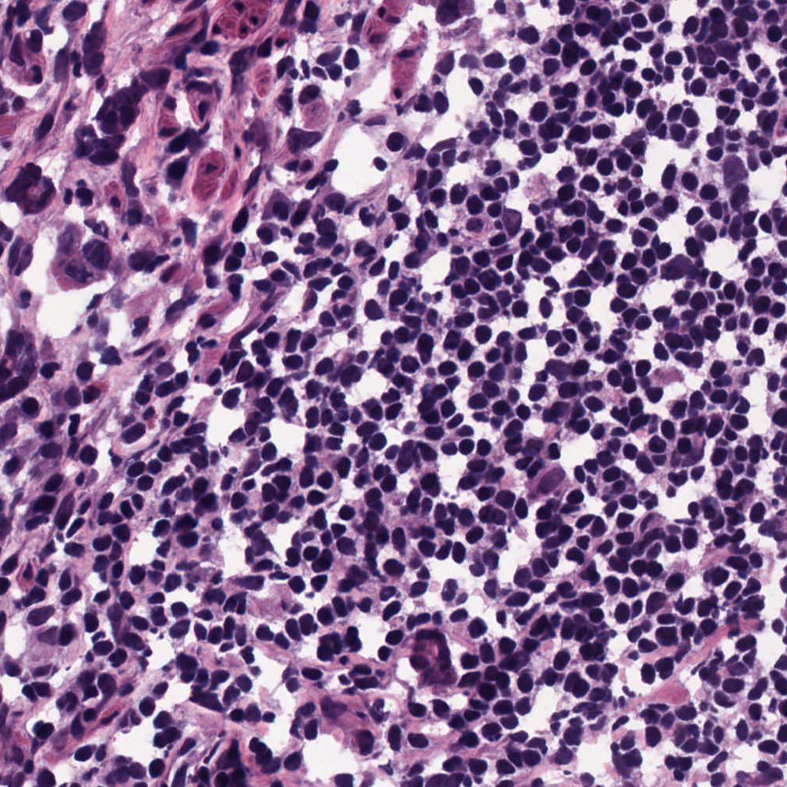
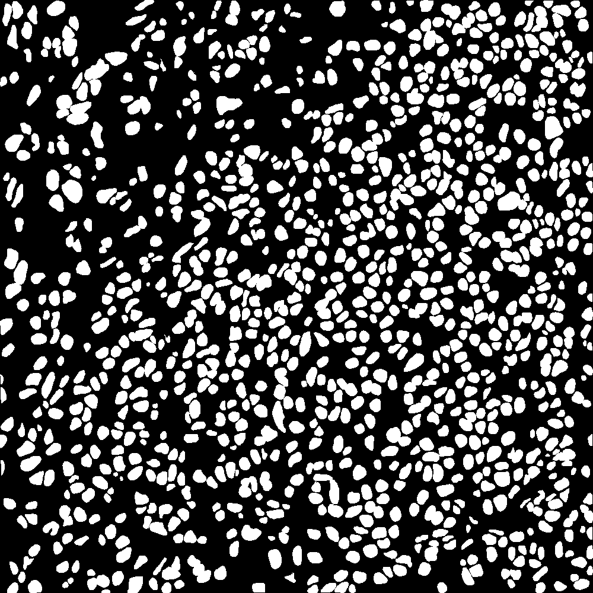

 

  <h3 align="center">Nuclei Segmentation in Histopathological Images with Enhanced U-Net3+</h3>

  

    Official implementation of the paper published at MIDL 2024
     
     
    <a href="https://github.com/CVPR-KIT/NucleiSeg-in-Histopathology-Images/issues">Report Bug</a>
    .
    <a href="https://github.com/CVPR-KIT/NucleiSeg-in-Histopathology-Images/issues">Request Feature</a>
  

***

## SETUP
1. Clone the repository
2. Create a new environment and install the packages required packages.
    <pre><code>pip install -r requirements.txt</code></pre>

## Dataset
The dataset for this challenge was obtained by carefully annotating tissue images of several patients with tumors of different organs and who were diagnosed at multiple hospitals. This dataset was created by downloading H&E stained tissue images captured at 40x magnification from TCGA archive. H&E staining is a routine protocol to enhance the contrast of a tissue section and is commonly used for tumor assessment (grading, staging, etc.). Given the diversity of nuclei appearances across multiple organs and patients, and the richness of staining protocols adopted at multiple hospitals, the training datatset will enable the development of robust and generalizable nuclei segmentation techniques that will work right out of the box.

### Training Data
Training data containing 30 images and around 22,000 nuclear boundary annotations has been released to the public previously as a dataset article in IEEE Transactions on Medical imaging in 2017.

### Testing Data
Test set images with additional 7000 nuclear boundary annotations are available here MoNuSeg 2018 Testing data.

Dataset can be downloaded from [Grand Challenge Webiste](https://monuseg.grand-challenge.org/)

A training sample with segmentation mask from training set can be seen below:
 |      Tissue             | Segmentation Mask (Ground Truth)  |
:-------------------------:|:-------------------------:
  |  

## Conversion from Annotations
* The dataset contains annotations of the nuclie and there is a need to convert it into ground truth image for the segmentation. It can be done using the [xmlParser.py](auxilary/xmlBinaryParser.py) file.

## Directory Configuration
The following structure should be followed for dataset directory configuration
* MonuSegData/
    * Test/
        * GroundTruth/
        * TissueImages/
    * Training/
        * GroundTruth/
        * TissueImages/

#
# Experiment Setup
* All the modifyable parameters related to the Experiment and Augmentation is present in the file [config.sys](config.sys). Setup all the parameters here before proceeding.

## Data Normalization 
* The images in MoNuSeg dataset are H&E stained images that has the follwoing properties-
    * purple for nuclei
    * pink for cytoplasmic components
For more information refer the following [link](https://www.leicabiosystems.com/en-kr/knowledge-pathway/he-staining-overview-a-guide-to-best-practices/).
* It is recommended to perform staining normalization before augmenatation. It can be done by using the [stainNormalization.py](auxilary/stainNormalization.py) file.
    <pre><code>python auxilary/stainNormalization.py --config config.sys</code></pre>

### Generate Metadata files of train and test images
* After preparing the data, run the following code to generate metadata files for image training and testing sets.
    <pre><code>python auxilary/dataValidity.py --config config.sys</code></pre>

## Augmentation
1. First Step is to perform Sliding Augmentation
    <pre><code>python slidingAug.py --config config.sys</code></pre>
    It will create the folder "slidingAug" with sliding augmentations. The parameters can be changed in the [config.sys](config.sys) file.
2. Perform Train and Validation split
    <pre><code>python auxilary/trainValsplit.py --config config.sys</code></pre>
    It will create the folder and files for Train, Validation from augmentated folder
3. Perform other augmentations on the images created in the previous step.
    <pre><code>python image_augmentation.py --config config.sys</code></pre>
    It will create augmentations on the slided images in a new folder named "augmentated". Parameters can be changed in [config.sys](config.sys) file.

## Train Model
After checking the dataset information in the [config.sys](config.sys) file,
<pre><code>python main.py --config config.sys |& tee log/log-08-07.txt</code></pre>
The parameters can be changed her as per requirement in the [config.sys](config.sys) file.. A log file is created in the [Log](log/) folder.

## Inference / Testing
For testing or inferencing images, make sure they are in the correct format and directory inforamtion is added correctly in the  [config.sys](config.sys) file.
<pre><code>python train_test.py --img_dir all --expt_dir &lt;Outputs/experiment_dir&gt; </code></pre>

## Contributing

Contributions are what make the open source community such an amazing place to be learn, inspire, and create. Any contributions you make are **greatly appreciated**.
* If you have suggestions for adding or removing projects, feel free to [open an issue](https://github.com/bluesaiyancodes/Allergic-Rhinitis/issues/new) to discuss it, or directly create a pull request after you edit the *README.md* file with necessary changes.
* Please make sure you check your spelling and grammar.
* Create individual PR for each suggestion.
* Please also read through the [Code Of Conduct](https://github.com/bluesaiyancodes/Allergic-Rhinitis/blob/main/CODE_OF_CONDUCT.md) before posting your first idea as well.

### Creating A Pull Request

1. Fork the Project
2. Create your Feature Branch (`git checkout -b feature/newFeature`)
3. Commit your Changes (`git commit -m 'Added some new Feature'`)
4. Push to the Branch (`git push origin feature/newFeature`)
5. Open a Pull Request

## License

Distributed under the MIT License. See [LICENSE](https://github.com/CVPR-KIT/NucleiSeg-in-Histopathology-Images/blob/main/LICENSE) for more information.

## Authors

* [**Bishal Ranjan Swain**](https://github.com/bluesaiyancodes) - *PhD Candidate at Kumoh National Insitute of Technology*

## Acknowledgements

* [Prof. Jaepil Ko](http://cvpr.kumoh.ac.kr/#team)
